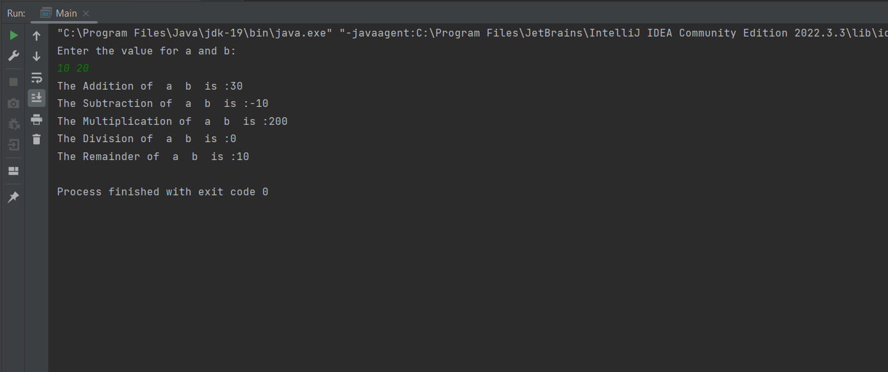

# JAVA-WEEKLY-ASSIGNMENT-1
## 1.Write a Java program to print the sum, multiply, subtract, divide and remainder of two numbers
```java
import java.util.Scanner;
public class ArithmaticOperations
{
    public static int add(int a,int b){
        int sum = a + b;
        return sum;
    }
    public static int sub(int a,int b){
        int dif = a - b;
        return dif;
    }
    public static int mul(int a,int b){
        int pro = a * b;
        return pro;
    }
    public static int div(int a,int b){
        int fra = a / b;
        return fra;
    }
    public static int mod(int a,int b){
        int rem = a % b;
        return rem;
    }
    public static void main(String[] args) {
        int a,b;
        System.out.println("Enter the value for a and b:");
        Scanner sc = new Scanner (System.in);
        a = sc.nextInt();
        b = sc.nextInt();
        System.out.println("The Addition of "+ " a " + " b " + " is :"+ add(a,b));
        System.out.println("The Subtraction of "+ " a " + " b " + " is :"+ sub(a,b));
        System.out.println("The Multiplication of "+ " a " + " b " + " is :"+ mul(a,b));
        System.out.println("The Division of "+ " a " + " b " + " is :"+ div(a,b));
        System.out.println("The Remainder of "+ " a " + " b " + " is :"+ mod(a,b));
    }
}
```
## OUTPUT


## 2.Write a Java program to compare two numbers
```java
import java.util.Scanner;

public class Compare {
    public static void compare1(){
        Scanner sca = new Scanner(System.in);
        System.out.println("Enter any three numbers:");
        int a= sca.nextInt();
        int b= sca.nextInt();
        int c= sca.nextInt();
        if(a==b && b==c)
        {
            System.out.println("All the three numbers are equal");
        }
        else if(a==b || a==c || b==c)
        {
            System.out.println("Two of the three numbers are equal");
            if(a==b)
            {
                System.out.println(a+" and "+b+" are equal");
            }
            else if(b==c)
            {
                System.out.println(b+" and "+c+" are equal");
            }
            else {
                System.out.println(a+" and "+c+" are equal");
            }
        }
        else {
            System.out.println("Any of the three numbers are not equal");
        }
    }

    public static void main(String[] args){

        compare1();


    }
}
```
## OUTPUT
[!Output](Outputs/numCompare.png)

## 3. Write a Java program to convert a string to an integer
```java
public class Convert {
    public static void convert(){
        double val1 = 100.235;
        int val2 = (int)val1;
        System.out.println("The int value of "+val1+" is:"+val2);

    }
    public static void main(String[] args) {
       convert();


    }
}

```
## OUTPUT
[!Output](Outputs/stringtoint.png)

## 4.Java Program to find area of rhombus
```java
import java.util.Scanner;
public class AreaofRhombus {
    public static int areaCalc(int d1,int d2)
    {
        int area = (d1*d2)/2;
        return area;
    }
    public static void main(String[] args){
        System.out.println("Enter the diagonals of the rhombus:");
        Scanner sc = new Scanner (System.in);
        int d1 = sc.nextInt();
        int d2 = sc.nextInt();
        System.out.println("The area of the given rhombus is: "+areaCalc(d1,d2)+"sq.meter");
    }

}

```
## OUTPUT
[!Output](Outputs/areaOfRhombus.png)

## 5.Write a Java program to find the number of days in a month
```java
import java.util.Scanner;
public class DayMonthCalc {
    public static int calc(int month){
        int days;

        if(month == 1 || month == 3 || month == 5 || month == 7 || month == 8 || month == 10 || month ==12)
        {
            days = 31;
        }
        else if(month == 4 || month == 6 || month == 9 || month == 11 ){
            days = 30;
        }
        else if(month == 2){
            days = 28;
        }
        else
        {
            System.out.println("Invalid Input");
            return 0;
        }

        return days;
    }

    public static void main(String[] args)
    {
        Scanner sc = new Scanner (System.in);
        System.out.println("Enter the month:");
        int month = sc.nextInt();
        System.out.println("Number of days the in the month "+ month +" is "+calc(month));
    }


}

```
## OUTPUT
[!Output](Outputs/dayMonthCalc.png)

## 6.Write a Java program to print the even numbers from 1 to 20
```java
import java.util.Scanner;
public class EvenNUm {
    public static void evenNum()
    {
        for(int i=1;i<=20;i++)
        {
            if(i%2 == 0)
            {
                System.out.println(i);
            }
        }
    }

    public static void main(String[] args){
        System.out.println("Even numbers from 1 to 20 is:");
        evenNum();
    }

}

```
## OUTPUT
[!Output](Outputs/evenNum.png)

## 7.Write a Java program to create a simple calculator
```java
import java.util.Scanner;
public class Calculator {
    public static int calc(int num1,int num2,char choice)
    {
        int res=0;
        switch (choice){
            case '+':
                res = num1+num2;
                break;
            case '-':
                res = num1-num2;
                break;
            case '*':
                res = num1*num2;
                break;
            case '/':
                res = num1/num2;
                break;
            case '%':
                res = num1%num2;
                break;
        }
        return res;
    }
    public static void main(String[] args)
    {
        Scanner sc = new Scanner(System.in);
        System.out.println("Enter the numbers and operation you would like to perform:");
        int num1 = sc.nextInt();
        char choice = sc.next().charAt(0);
        int num2 = sc.nextInt();
        System.out.println("Result for the calculation is :"+calc(num1,num2,choice));
    }


}

```
## OUTPUT
[!Output](Outputs/calculator.png)

## 8.Write a Java program to print multiplication table of given number
```java
import java.util.Scanner;
public class MultiplicationTable {
    public static void table(int num)
    {
        for(int i=1; i<=10; i++)
        {
            System.out.println(num + " * "+ i +" = "+ num*i );
        }
    }

    public static void main(String[] args){
        Scanner sc = new Scanner (System.in);
        System.out.println("Enter the number to print the multiplication table:");
        int num = sc.nextInt();
        System.out.println("The multiplication table is:");
        table(num);

    }
}

```
## OUTPUT
[!Output](Outputs/mulTables.png)